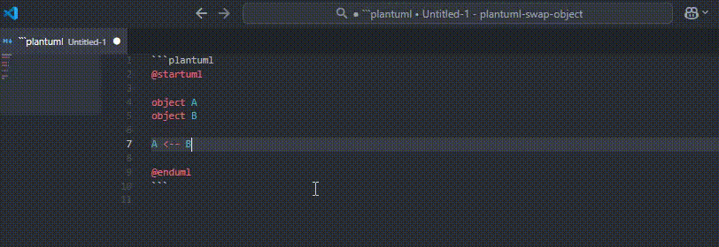

# [plantuml-swap-object](https://github.com/hakohumi/plantuml-swap-object.git) README

This extension allows the relationship between objects in a PlantUML description and the direction of arrows to be swapped.

## Features



### Swap Object

```text
A --> B
↓
B --> A
```

### Swap Arrows

```text
A --> B
↓
A <-- B
```

### Swap Object and Arrows

```text
A --> B
↓
B <-- A
```

<!-- ## Extension Settings

TODO: 設定があれば書く

Include if your extension adds any VS Code settings through the `contributes.configuration` extension point.

For example:

This extension contributes the following settings:

- `myExtension.enable`: Enable/disable this extension.
- `myExtension.thing`: Set to `blah` to do something.

T.B.D. -->

## Known Issues

- Problem that "Swap Object" with `abcd A --> B efgh` results in `B --> A efgh`.

## Release Notes

[CHANGELOG.md](CHANGELOG.md)

---
